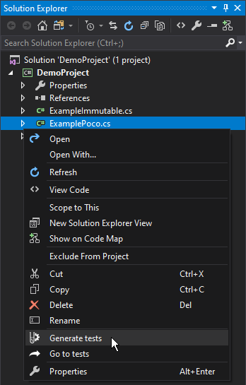
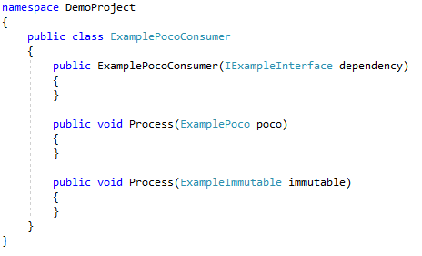

# Overview
## Build and Release Status
| Pipeline  |  Status |
|----------|:-------------|
|Master Build||
|Latest Release| |

## Introduction
The SentryOne Unit Test Generator extension generates tests for classes written in C#. The extension covers basic tests automatically (for example, checking for correct property initialization), and creates placeholder tests for methods.  

Test Project organization is simple and automatic because the tests are created in the test project with the same hierarchy defined in the source project. The extension can be used to modify tests later in the life cycle after refactoring or adding new functionality:

* Add tests for new methods
* Regenerate tests as needed

## Supported Frameworks
The following test frameworks are supported:

* MSTest 
* NUnit 
* xUnit 

The following mocking frameworks are supported:

* NSubstitute 
* Moq 
* Rhino Mocks 
* FakeItEasy 

## Using the Extension

After installation, open the extension through:

* The solution explorer context menu
* The code editor context menu

## Extension Functions

The following functions are available:

* **Generate tests** - generates tests for the selected entity.
* **Go to tests** - opens the file containing the tests for the selected object. This option also works if you are selecting a member in the code window.
* **Regenerate tests** - replaces existing tests with new ones. This is useful for cases like changes in a constructor signature. 

_**Important:** Regenerating a test will replace any code that you have added to the test class or method that is being regenerated. Please use this with care._

Using the code editor context menu:

Using the solution explorer context menu:

**Regenerate tests** and **Go to tests** are not available at higher levels in the solution explorer (for example when you have a folder or project selected). **Regenerate tests** is not shown by default, to prevent accidental overwriting of test code. Hold SHIFT while you open the context menu to use this option.

## Use Case

Consider this simple class:

 

Although the constructor and methods are not implemented, it serves as a good example because the extension generates tests based on signatures only. The following illustrates the results of generating tests for this class.

 

Notice that the dependency for the class has been automatically mocked & injected, and there are generated tests for the constructor. There are also tests to verify that parameters can’t be null for both constructors and methods. Note that the generator is producing values required for testing – both initializing a POCO using an object initializer and an immutable class by providing values for its constructor.

## Controlling the process

The Unit Test Generator extension options page allows for control of various aspects of the process. 
Generation Side
* Select the test and mocking frameworks to be used
* Control the naming conventions for: test projects, classes, and files

_Note: The default for project naming is **‘{0}.Tests’**. For example, a project named **MyProject** would be associated with a test project called **MyProject.Tests**._

_Note: The default for the class and file naming is **‘{0}Tests’**. For example, a class called **MyClass** would be associated with a test class called **MyClassTests**._

## Other Options

* Control whether test projects are automatically created
* Control whether references are automatically added to test projects
* Control the version of the framework dependencies that’s used

_Note: If these options are not set, the extension uses the latest version. This does not apply to NUnit 2 because NUnit 2 and NUnit 3 share the same NuGet package name and the NUnit 2 version will always be 2.6.4 if this is left blank._

_**Important**: Currently the extension doesn’t handle automatically creating test projects for .NET Core apps. It works as expected with.NET framework and .NET Standard projects. For .NET Core apps, please create the test project manually. Adding test classes and methods works normally once the project is in place._
