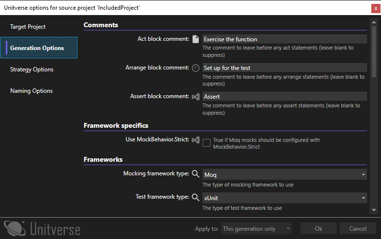
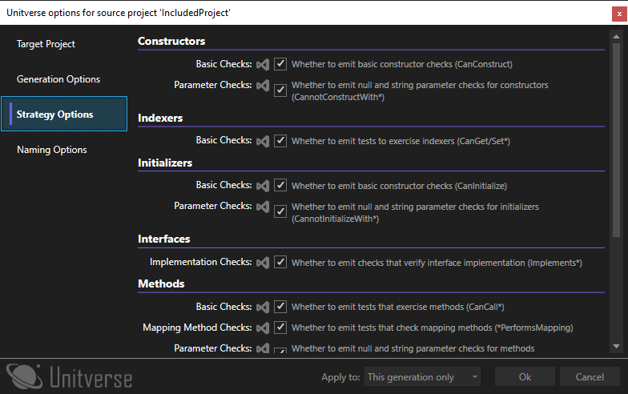
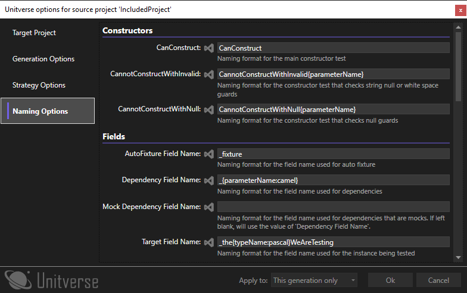

# Configuration 🛠

You can configure Unitverse in three ways:

* By changing the options in Visual Studio by going to Tools->Options->Unitverse.
* By settings the options in a `.unitTestGeneratorConfig` file which works just like a `.editorConfig` file.
* By using the per-generation user interface in order to control the process.

It is worth noting that these options apply in slightly different scopes.

* Options configured in the Visual Studio Options dialog apply to all solutions
* Options configured in a `.unitTestGeneratorConfig` file apply to all solutions at the same level or a child level on disk
* Options that are applied to the session using the per-generation user interface persist until you close Visual Studio.
* Options that are detected from the selected target project apply to that individual generation (if 'Detect target frameworks' is set to true).

You can create a `.unitTestGeneratorConfig` file which contains the options you currently have configured in Visual Studio by going to the 'Export' options page. For more information on this, see the 'Setting options per-project' section below.

The per-generation user interace is, by default, set to show only when a target project can not be automatically matched. You can change this by going to Tools->Options->Unitverse or by setting the relevant option in a `.unitTestGeneratorConfig` file, or by holding the Control key while selecting any 'Generate tests...' menu item. This user interface also allows you to override the target project selection, if you want to generate tests in a different project or because your naming format isn't consistent. To see what the user interface looks like, please see the 'Per-generation user interface' section below.

### Options layers

The options are also layered - configuration files and session settings are not a complete set of settings - just what is configured in the file or dialog. The layers are loaded in order:

1. Visual studio settings
2. Configuration files
3. Session settings
4. Framework auto-detection

If you are not sure how a particular option has been configured, you can open up the per-generation UI, which has a small icon next to each option which you can hover to find out where a configuration value came from. Also, options that are detected from a target project that differ from the options loaded from Visual Studio / config files will cause a message to be logged to the Output window in Visual Studio.

The source icons are as follows:


* The file icon is for settings loaded from a configuration file, and hovering the file icon with your mouse will tell you which configuration file the option was loaded from.
* The clock icon is for settings that were previously selected in the per-generation UI and 'This session' was selected next to 'Apply to'.
* The Visual Studio icon is for settings configured in the Options dialog.
* The magnifying glass icon is for settings that have been automatically detected from the selected target project.

## Generation Options ⚙

* Select the test and mocking frameworks to be used
* Control the naming conventions for: test projects, classes, and files
* Control whether to search for test types by filename only or use type name as a fallback
* Control preferences around using placement, generation without projects & partial generation
* Control whether mock configuration calls are automatically emitted
* Control whether tests for internal members are emitted
* Control whether to emit a derived test class to expose protected members
* Control whether Arrange / Act / Assert comments are emitted and what they say

### Default Project Naming

The default for project naming is `{0}.Tests`. For example, a project named `MyProject` would be associated with a test project called `MyProject.Tests`.

You can specify multiple patterns in the 'Project naming convention' option by separating them with a semicolon. So for example, if the naming pattern was set to `{0}.Tests;{0}.UnitTests;{0}.Cheese` then it would first look for `MyProject.Tests`, then `MyProject.UnitTests` and finally `MyProject.Cheese`.

#### Manual Project Mapping

You can override the default naming behaviour by going to Tools->Options->Unitverse->Project Mappings and entering the source and target project. Alternatively, you can set these in a `.unitTestGeneratorConfig` file with a `[Mappings]` section:

```
[Mappings]
SourceProject=TargetProject
OtherSourceProject=OtherTargetProject
```

In this scenario, tests for types in the SourceProject project would be created in the TargetProject project. Note that when adding mappings in `.unitTestGeneratorConfig` files, the changes are additive. So any extra mappings defined in configuration files defined closer to the project will add to the list of mappings already defined, not replace them.

### Default Class/File Naming

The default for the class and file naming is `{0}Tests`. For example, a class called `MyClass` would be associated with a test class called `MyClassTests` and a file called a class called `MyClass.cs` would be associated with a test class called `MyClassTests.cs`. Note that Unitverse can be configured to find test types that match the correct type name even if they are in an incorrectly named file. By default it will do this only for a class in the correct namespace. However, you can configure this to match any class in the target project, or disable the fallback finding mechanism by going to Tools -> Options -> Unitverse -> Generation Options -> Fallback type finding method.

## Strategy Options 🗺

Unitverse generates tests using 'strategies'. There are strategies for testing constructors & parameters, properties, methods & parameters etc. Not all tests are useful for every code base. One example would be that null checks are less useful in a codebase making use of nullable reference types. In this instance, you may want to turn off 'Constructors - Parameter Checks' and 'Methods - Parameter Checks'. The groups that you can disable are listed in the table below. All groups are enabled by default.

| Category | Group | Meaning |
| - | - | - |
| Constructors | Basic Checks | Whether to emit basic constructor checks (CanConstruct) |
| Constructors | Parameter Checks | Whether to emit null and string parameter checks for constructors (CannotConstructWith*) |
| Initializers | Basic Checks | Whether to emit basic constructor checks (CanInitialize) |
| Initializers | Parameter Checks | Whether to emit null and string parameter checks for initializers (CannotInitializeWith*) |
| Methods | Basic Checks | Whether to emit tests that exercise methods (CanCall*) |
| Methods | Mapping Method Checks | Whether to emit tests that check mapping methods (*PerformsMapping) |
| Methods | Parameter Checks | Whether to emit null and string parameter checks for methods (CannotCallWith*) |
| Indexers | Basic Checks | Whether to emit tests to exercise indexers (CanGet/Set*) |
| Properties | Basic Checks | Whether to emit tests to exercise properties (CanGet/Set*) |
| Properties | Initialized Property Checks | Whether to emit tests that check that properties have been initialized based on constructor parameter names (*IsInitializedCorrectly) |
| Operators | Basic Checks | Whether to emit tests to exercise operators (CanCallOperator) |
| Operators | Parameter Checks | Whether to emit null and string parameter checks for operators (CannotCallOperatorWith*) |
| Interfaces | Implementation Checks | Whether to emit checks that verify interface implementation (Implements*) |

## Test Method Naming Options ✍

Unitverse allows you to customise the method names that are generated, so you can fit the extension in with your existing code base.

There are replacable tokens which can be substituted into the method names as follows:

| Token | Meaning | Available |
| - | - | - |
| typeName | The name of the type that the tested item belongs to | Always |
| interfaceName | The name of the interface for which generation is currently being performed | When generating tests for an interface implementation |
| memberName | The unambiguous name of the member being tested (see below) | Everywhere except constructors |
| memberBareName | The amiguous name of the member being tested (see below) | Everywhere except constructors |
| parameterName | The name of the parameter being tested for guard conditions | Method guard condition generation & dependency field name generation |
| typeParameters | The list of type parameters for an interface | When generating tests for an interface implementation |

### Formatting options

There are also formatting options for token replacement. This can be achieved with the `{token:format}` syntax - so for instance `{typeName:lower}` will produce the name of the type in lower case. The formatters available are as follows:

| Suffix | Meaning |
| - | - |
| lower | The token value is emitted in lower case |
| upper | The token value is emitted in upper case |
| camel | The token value is emitted in camel case (i.e. the first letter is converted to lower case) |
| pascal | The token value is emitted in pascal case (i.e. the first letter is converted to upper case) |

### On unambiguous vs. ambiguous names

When generating for a method with overloads, the names are decorated with 'WithParameterName' suffixes so that each method can be clearly identified. The unambiguous name includes these suffixes and the ambiguous name does not.

## Setting options per-project 📐

You can set settings per-project if you need to (for example if you work with some code that uses MSTest and some that uses NUnit). In order to do this, you can create a `.unitTestGeneratorConfig` file, which is formatted similarly to .editorConfig files, just ignoring the file type heading.

You can set any member of the [IGenerationOptions](https://github.com/mattwhitfield/Unitverse/blob/master/src/Unitverse.Core/Options/IGenerationOptions.cs), [IStrategyOptions](https://github.com/mattwhitfield/Unitverse/blob/master/src/Unitverse.Core/Options/IStrategyOptions.cs) or the [INamingOptions](https://github.com/mattwhitfield/Unitverse/blob/master/src/Unitverse.Core/Options/INamingOptions.cs) interfaces using this method. For example, the following content in a `.unitTestGeneratorConfig` would set the test framework to MSTest, the mocking framework to NSubstitute and the test project naming convention to `<project_name>.UnitTests`:

```
test_project_naming={0}.UnitTests
framework-type=MSTest
MockingFrameworkType=NSubstitute
```

To generate a `.unitTestGeneratorConfig` file that contains all the options as they are set in the Visual Studio Options dialogue, you can go to the 'Options Export' configuration page which contains the functionality allowing you to export the current configuration.

Note that the formatting for the member names is case insensitive, and underscores and hyphens are ignored. Hence `frameworkType`, `framework-type`, `FRAMEWORK_TYPE` and `FRAME-WORK-TYPE` all resolve to the `FrameworkType` member of `IGenerationOptions`. The rules for file finding & resolution work exactly the same as they do for `.editorConfig` files - in short, all folders from the project file to the root are searched for a `.unitTestGeneratorConfig` file, and files 'closer' to the project file take precedence if the same option is set in more than one file.

You can also use a UI to modify a `.unitTestGeneratorConfig` file by double-clicking on the file in the solution explorer. When loading a file, it may not contain all the configurable elements. However, after saving it will contain all the configuration options, similar to when you export the configuration from the Visual Studio Options dialog.

## Per-generation user interface 🖥

If you are using the per-generation user interface (either because you have configured it in Tools->Options->Unitverse or because you are holding Control while selecting a 'Generate tests...' menu item), then a dialog is shown before each generation. The dialog is organised into four tabs as shown in the below images. At the bottom is a drop-down labeled 'Apply to:' - this allows you to save the options that you have selected. The options are:

* This generation only - the options selected are not saved, and apply to the current generation only
* This session - the options are persisted until Visual Studio closes.
* Configuration file - you are able to choose a folder in which to save a `.unitTestGeneratorConfig`. Note that this will overwrite any existing file.
* Visual studio settings - the options will be persisted to the Visual Studio options

Setting the target project in which tests will be generated:


Setting the options relating to generation. Note that most of the options you can configure are here, but some (for example 'project naming') do not make sense in this context and are not shown:



Setting the options relating to which strategies to apply:



Setting the options relating to naming:

