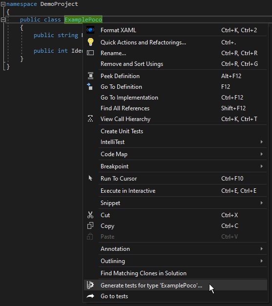
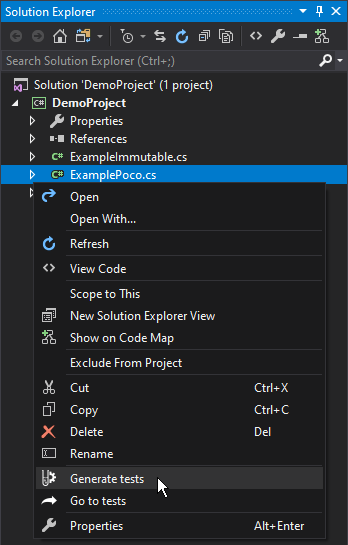
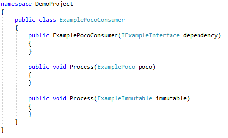
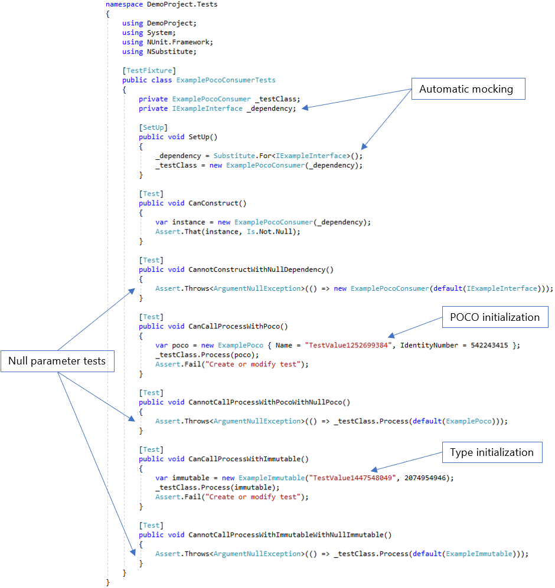
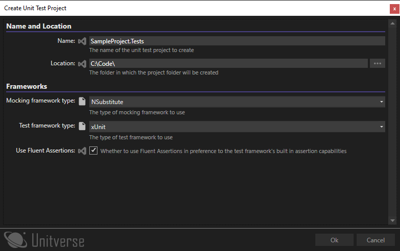

# Getting Started 🚗

After installation, you can access the functionality of the extension through:

* The solution explorer context menu
* The code editor context menu

## Extension Functions ⌨️

The following functions are available:

* **Generate tests** - generates tests for the selected entity.
* **Go to tests** - opens the file containing the tests for the selected object. This option also works if you are selecting a member in the code window.
* **Regenerate tests** - replaces existing tests with new ones. This is useful for cases like changes in a constructor signature. 
* **Create unit test project** - creates a new empty unit test project and installs the relevant packages.

_**Important:** Regenerating a test will replace code that you have added to the test class or method that is being regenerated. Please use this with care._

Using the code editor context menu:

Using the solution explorer context menu:

**Regenerate tests** and **Go to tests** are not available at higher levels in the solution explorer (for example when you have a folder or project selected). **Regenerate tests** is not shown by default, to prevent accidental overwriting of test code. Hold SHIFT while you open the context menu to use this option.

## Use Case 💬

Consider this simple class:

 

Although the constructor and methods are not implemented, it serves as a good example because the extension largely generates tests based on signatures only. The following illustrates the results of generating tests for this class.

 

Notice that the dependency for the class has been automatically mocked & injected, and there are generated tests for the constructor. There are also tests to verify that parameters can’t be null for both constructors and methods. Note that the generator is producing values required for testing – both initializing a POCO using an object initializer and an immutable class by providing values for its constructor.

For more examples of the output that Unitverse generates, please see the [Examples section](examples/index.md).

## Creating test projects 👷

When you right-click on a project in the solution explorer, the option 'Create unit test project' allows you to easily add unit test projects:

 
 
The name is derived from the source project using the first project naming pattern. So if your naming pattern is `{0}.Tests;{0}.UnitTests` and you are creating tests for a project called `SampleProject` then the defaulted project name would be `SampleProject.Tests`. The location will default to the parent folder of the folder that contains the .csproj file, and when the project is create, a project directory will be created.

The frameworks are defaulted using the same configuration hierarchy that the rest of the extension uses. For more information on configuration, see the [Configuration](configuration.md) section.

When you click OK, the new project is added and the relevant NuGet packages are installed.

The new project will use the same framework as the source project, except for `netstandard*` projects, which will target `netcoreapp3.1`.
